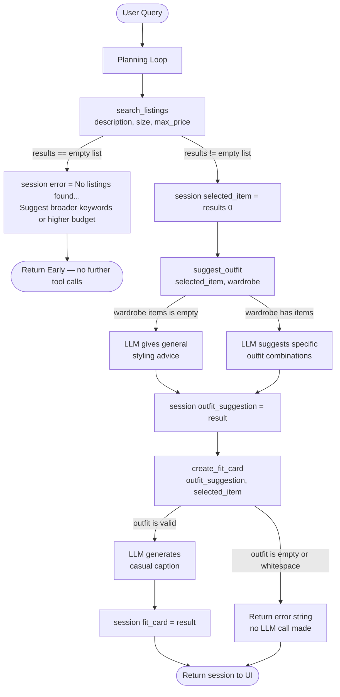

# FitFindr — planning.md

> Complete this document before writing any implementation code.
> Your spec and agent diagram are what you'll use to direct AI tools (Claude, Copilot, etc.) to generate your implementation — the more specific they are, the more useful the generated code will be.
> Your planning.md will be reviewed as part of your submission.
> Update it before starting any stretch features.

---

## Tools

List every tool your agent will use. For each tool, fill in all four fields.
You must have at least 3 tools. The three required tools are listed — add any additional tools below them.

### Tool 1: search_listings

**What it does:**
Searches all of the listings data set for thrift items matching a description based on keywords, size filtering, and price ceiling. Returns a list sorted by relevance of matching listings, or empty list if there is no match.

**Input parameters:**
<!-- List each parameter, its type, and what it represents -->
- `description` (str): Keywords describin what the user is looking for in a listing,
- `size` (str): Size string to filter by, case-insensitive ('M' = 'm')
- `max_price` (float): Inclusive maximum price bound, if left empty then no price filter.

**What it returns:**
A list of listing dicts sorted by relevance score (highest first). Each dict contains `id`, `title`, `description`, `category`, `style_tags` (list), `size`, `condition`,
`price` (float), `colors` (list), `brand`, `platform`.
Empty list if there is no matches, doesn't throw exceptions.

**What happens if it fails or returns nothing:**
The agent checks if the returned list is empty. If it is, it sets `session["error"]` to "No listings found matchinig your description, size, and budget, Try broader keywords, a different size, or a higher price limit." and returns early without calling suggest_outfit or create_fit_card.

---

### Tool 2: suggest_outfit

**What it does:**
Given the thrifted item and the user's wardrobe, calls the LLM to suggest 1-2 complete outfit combinations using specific names pieces from the wardrobe. If the wardrobe is empty then it gives generalized tips for styling the item.

**Input parameters:**
<!-- List each parameter, its type, and what it represents -->
- `new_item` (dict): A listing dict for the item the user is considering (from search_listings)
- `wardrobe` (dict): A wardrobe dict5 with an `'items'` key containing a list of the wardrobe item dicts. Can be empty.

**What it returns:**
A string with 1-2 outfit suggestions. If the wardrobe is empty, generalizes styling advice and how to wear the outfit.

**What happens if it fails or returns nothing:**
If `wardrob['items']` is empty, the LLM is prompted for general styling ideas rather than specific combinationns. The agent continues to create_fit_card with this general style advice, doesn't just stop.

---

### Tool 3: create_fit_card

**What it does:**
Takes the outfit suggestion string and the new item dict and prompts the LLM to write a social media style caption capturing the outfit's vibe. Uses higher LLM temprature so the output varies each time.

**Input parameters:**
<!-- List each parameter, its type, and what it represents -->
- `outfit` (...): The outfit suggestion string returned by `suggest_outift()`

**What it returns:**
A 2-4 sentence caption string that feels like a real OOTD post, menttions the items name, price, and platform all naturally and not repetitively.

**What happens if it fails or returns nothing:**
If `outfit` is empty, returns the string "Error: outfit description is missing — cannot generate a fit card." Doesn't ever throw an exception.

---

### Additional Tools (if any)

<!-- Copy the block above for any tools beyond the required three -->

---

## Planning Loop

**How does your agent decide which tool to call next?**

1. Parse the user's message for description, size, and max_price.
2. Call `search_listings(description, size, max_price)`.
3. **If results is empty:** set `session["error"]` = "No listings found..." and return.
   Do NOT proceed to step 4.
4. **If results is non-empty:** set `session["selected_item"] = results[0]` (top match).
5. Call `suggest_outfit(session["selected_item"], session["wardrobe"])`.
6. Set `session["outfit_suggestion"]` = returned string.
7. Call `create_fit_card(session["outfit_suggestion"], session["selected_item"])`.
8. Set `session["fit_card"]` = returned string.
9. Return the complete session to the UI

---

## State Management

**How does information from one tool get passed to the next?**
The agent maintains a `session` dict throughout the interaction. It is initialized
before the planning loop runs and updated after each tool call:

```python
session = {
    "query": str,              # original user message
    "wardrobe": dict,          # loaded once at start (example or empty)
    "selected_item": dict,     # set after search_listings succeeds
    "outfit_suggestion": str,  # set after suggest_outfit runs
    "fit_card": str,           # set after create_fit_card runs
    "error": str | None,       # set if any tool fails; None otherwise
}
```
---

## Error Handling

For each tool, describe the specific failure mode you're handling and what the agent does in response.

| Tool | Failure mode | Agent response |
|------|-------------|----------------|
| search_listings | No results match the query |Sets session["error"] = "No listings found matching your description, size, and budget. Try broader keywords, a different size, or a higher price limit." Returns early — suggest_outfit and create_fit_card are never called.  |
| suggest_outfit  | Wardrobe is empty | Calls LLM with a general styling prompt instead of a wardrobe-specific one. Returns general advice string. Agent continues to create_fit_card. |
| create_fit_card | Outfit input is missing or incomplete | Returns "Error: outfit description is missing — cannot generate a fit card." immediately. No LLM call made. No exception raised. |

---

## Architecture

<!-- Draw a diagram of your agent showing how the components connect:
     User input → Planning Loop → Tools (search_listings, suggest_outfit, create_fit_card)
                                                                          ↕
                                                                   State / Session
     Show what triggers each tool, how state flows between them, and where error paths branch off.
     ASCII art, a Mermaid diagram (https://mermaid.js.org/syntax/flowchart.html), or an embedded
     sketch are all fine. You'll share this diagram with an AI tool when asking it to implement
     the planning loop and each individual tool. -->



---

## AI Tool Plan

<!-- For each part of the implementation below, describe:
     - Which AI tool you plan to use (Claude, Copilot, ChatGPT, etc.)
     - What you'll give it as input (which sections of this planning.md, your agent diagram)
     - What you expect it to produce
     - How you'll verify the output matches your spec before moving on

     "I'll use AI to help me code" is not a plan.
     "I'll give Claude my Tool 1 spec (inputs, return value, failure mode) and ask it to implement
     search_listings() using load_listings() from the data loader — then test it against 3 queries
     before trusting it" is a plan. -->

**Milestone 3 — Individual tool implementations:**

- **search_listings:** Give Claude the Tool 1 spec block (inputs, return value, failure
  mode) plus the `load_listings()` docstring. Ask it to implement the function using
  only `load_listings()` — no file I/O. Verify: does it filter by all 3 params? Does
  it handle empty results without raising? Test with 3 queries (match, no match,
  price edge case) before trusting it.

- **suggest_outfit:** Give Claude the Tool 2 spec block and the wardrobe schema.
  Ask it to implement using Groq `llama-3.3-70b-versatile`. Verify: does it branch
  on empty wardrobe? Does it return a non-empty string in both branches? Test with
  `get_example_wardrobe()` and `get_empty_wardrobe()`.

- **create_fit_card:** Give Claude the Tool 3 spec block. Ask it to implement with
  temperature > 0.9. Verify: does it guard against empty `outfit`? Run it 3 times
  on the same input — outputs must differ. Check caption sounds casual, not like a
  product description.


**Milestone 4 — Planning loop and state management:**

- Give Claude the Architecture diagram and the Planning Loop + State Management
  sections. Ask it to implement `run_agent()` in `agent.py`. Verify before running:
  does it branch on empty search results? Does it store values in `session` between
  calls? Does it ever call `suggest_outfit` unconditionally? Fix anything that does.


---

## A Complete Interaction (Step by Step)

Write out what a full user interaction looks like from start to finish — tool call by tool call. Use a specific example query.

**Example user query:** "I'm looking for a vintage graphic tee under $30. I mostly
wear baggy jeans and chunky sneakers. What's out there and how would I style it?"

**Step 1:**
Agent calls `search_listings("vintage graphic tee", size=None, max_price=30.0)`.
The function loads listings, filters to items priced ≤ $30, scores each by keyword
overlap with "vintage graphic tee", drops zero-score items, and returns the ranked list.
Top result: `{"title": "Faded Band Tee", "price": 22.0, "platform": "Depop", ...}`.
Agent sets `session["selected_item"] = results[0]`.

**Step 2:**
Agent calls `suggest_outfit(session["selected_item"], session["wardrobe"])`.
Wardrobe contains baggy jeans and chunky sneakers. LLM is prompted with the item
details and wardrobe contents. Returns: "Pair this faded band tee with your wide-leg
jeans and platform Docs for a 90s grunge look. Roll the sleeves once and tuck the
front corner slightly for shape."
Agent sets `session["outfit_suggestion"]` = this string.

**Step 3:**
Agent calls `create_fit_card(session["outfit_suggestion"], session["selected_item"])`.
LLM is prompted with the outfit suggestion and item details (name, price, platform).
Returns: "thrifted this faded band tee off depop for $22 and honestly it was made
for my wide-legs 🖤 full look in my stories"
Agent sets `session["fit_card"]` = this string.

**Final output to user:**
- **Search result panel:** Faded Band Tee — $22, Depop, Good condition
- **Outfit suggestion panel:** "Pair this faded band tee with your wide-leg jeans..."
- **Fit card panel:** "thrifted this faded band tee off depop for $22..."
